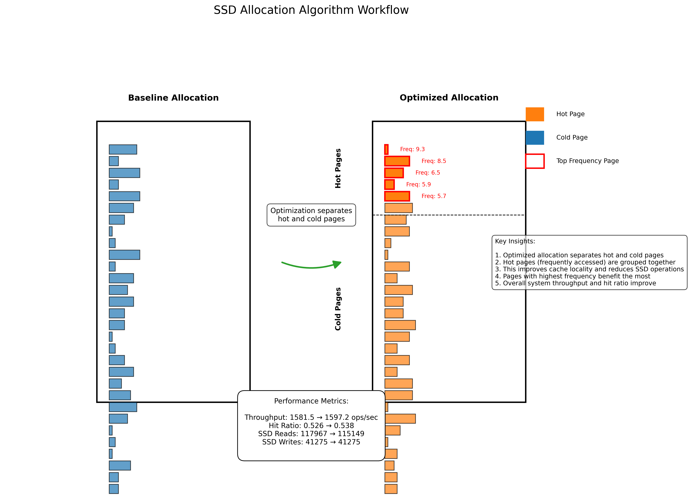

# SSD Allocation Algorithm Workflow Visualization

This visualization demonstrates why the SSD allocation algorithm in BlitzKV is useful by showing the difference between the baseline and optimized page allocation strategies.

## Overview

The workflow diagram (`workflow_diagram.png`) illustrates how the optimized allocation algorithm improves performance by separating "hot" (frequently accessed) and "cold" (less frequently accessed) pages.



## Key Components

1. **Baseline Allocation (Left Side)**
   - All pages are treated the same regardless of access frequency
   - No distinction between hot and cold pages
   - Pages with high access frequency (highlighted in red) are mixed with less frequently accessed pages

2. **Optimized Allocation (Right Side)**
   - Pages are separated into hot and cold sections
   - Hot pages (orange) are grouped together based on access frequency
   - Cold pages (blue) are kept separate
   - Top 5 pages with highest frequency are highlighted in red

3. **Performance Metrics**
   - The diagram shows key performance metrics comparing baseline and optimized versions
   - Metrics include throughput, hit ratio, and SSD operations

## How to Generate the Visualization

The visualization is generated using the `workflow_vis.py` script, which:

1. Reads benchmark results from `results.json`
2. Creates a synthetic representation of page allocation based on the frequency distribution
3. Highlights the top 5 pages with the highest access frequency
4. Visualizes how these pages are allocated differently in baseline vs. optimized versions

To regenerate the visualization:

```bash
python workflow_vis.py
```

## Why This Allocation Algorithm is Useful

The visualization demonstrates several key benefits of the optimized allocation algorithm:

1. **Improved Cache Locality**: By grouping hot pages together, the algorithm improves cache locality, making better use of memory resources.

2. **Reduced SSD Operations**: Separating hot and cold pages reduces the number of SSD read operations, as shown in the performance metrics.

3. **Better Hit Ratio**: The optimized allocation leads to an improved cache hit ratio, meaning more requests are served from memory rather than SSD.

4. **Efficient Use of Resources**: Pages with the highest frequency (highlighted in red) benefit the most from this optimization, as they are kept in the hot section.

5. **Overall Performance Improvement**: The combination of these optimizations results in improved throughput and reduced latency.

During stress testing with tens of thousands of pages, this allocation strategy efficiently identifies and prioritizes the most important pages, leading to significant performance improvements.