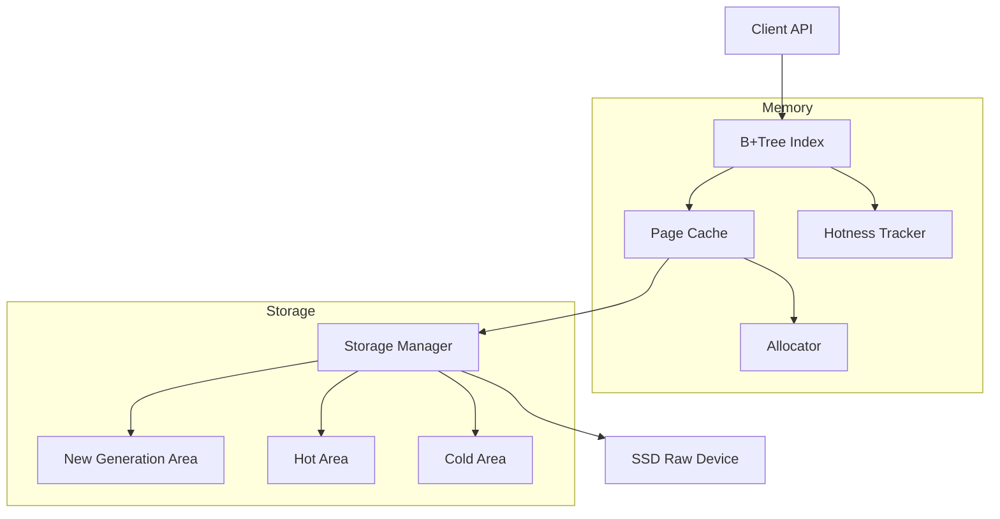
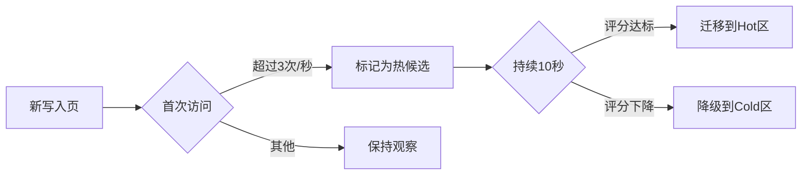

# 面向SSD的键值分离存储引擎设计文档

## 1. 设计概述
### 1.1 设计目标
- **SSD优化**：所有I/O操作以4KB页为基本单位，direct I/O对齐
- **高效内存管理**：内存中维护B+Tree索引，仅存储元数据
- **冷热智能分离**：自动识别热点数据，降低读/写放大
- **简化实现**：核心逻辑控制在<5K行Rust代码

### 1.2 架构总览


## 2. 核心组件设计
### 2.1 内存索引结构
采用Rust 标准库的BTreeMap实现B+Tree索引.


### 2.2 页缓存设计
采用二级缓存策略：
1. **Active Buffer**：存储最近写入的脏页
```rust
struct ActiveBuffer {
    buffer: HashMap<u32, Page>,
    lru_list: Vec<u32>,
    max_size: usize,
}

impl ActiveBuffer {
    const MAX_SIZE: usize = 1024; // 4MB内存消耗
    
    fn new() -> Self {
        Self {
            buffer: HashMap::new(),
            lru_list: Vec::new(),
            max_size: Self::MAX_SIZE,
        }
    }
}
```
2. **Read Cache**：使用Clock-Pro算法管理
```rust
struct CacheEntry {
    page: Page,
    ref_bit: bool,
    hotness: u8, // 3 bits used
}

struct ReadCache {
    circular_buffer: Vec<CacheEntry>,
}
```

### 2.3 存储分配策略
#### 三区混合分配：
| 区域         | 页大小  | 分配策略          | 适用场景          |
|-------------|--------|-------------------|------------------|
| 新生代       | 4KB    | 连续分配          | 刚进入的对象|
| 热数据区     | 4KB    | Slab分配+bitmap   | 高频访问对象      |
| 冷数据区     | 64KB   | 大页聚集分配       | 低频访问对象      |


## 3. 冷热分离机制
### 3.1 动态评分模型
```rust
struct HotnessScorer;

impl HotnessScorer {
    fn calculate(&self, meta: &ObjectMeta) -> f32 {
        let freq = (meta.access_count as f32).sqrt();
        let age = now() - meta.create_time;
        let penalty = if meta.ttl > 0 {
            age as f32 / meta.ttl as f32
        } else {
            0.0
        };
        freq / (1e-6 + (now() - meta.last_access) as f32 * (1.0 + penalty))
    }
}
```

### 3.2 页重组策略
冷热检测状态机：


## 4. SSD优化设计
### 4.1 写入路径优化
```rust
struct SSDWriter;

impl SSDWriter {
    fn write_batch(&mut self, pages: &mut Vec<Page>) {
        self.align_to_4kb(pages);
        self.sort_by_lba(pages);  // 减少SSD内部碎片
        
        for page in pages.iter() {
            self.direct_io_write(page);
            if self.gc_needed() {
                self.background_gc();  // 异步垃圾回收
            }
        }
    }
}
```

### 4.2 磨损均衡策略
```rust
struct WearLeveler {
    erase_counts: [u32; MAX_BLOCKS],
}

impl WearLeveler {
    fn choose_block(&self) -> u32 {
        self.erase_counts
            .iter()
            .enumerate()
            .min_by_key(|(_idx, &count)| count)
            .map(|(idx, _)| idx as u32)
            .unwrap_or(0)
    }
}
```

## 6. 评估指标设计
| 指标              | 测量方法                          | 目标值       |
|-------------------|----------------------------------|-------------|
| 写放大系数         | 物理写入量 / 逻辑写入量           | <1.5        |
| 有效数据密度       | 有效对象数 / (总页数×页容量)      | >85%        |
| 冷热分离准确率     | (正确迁移数)/(总迁移数)           | >90%        |
| 缓存命中率         | 命中次数/(命中+未命中)            | >95%        |
